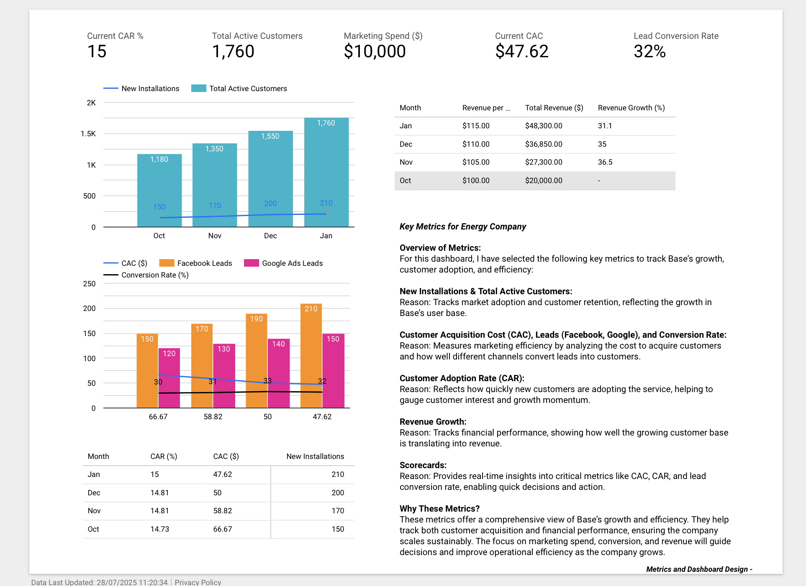

#  Energy Company Growth Dashboard (Looker)

A Looker-powered analytics dashboard designed to help an energy company monitor and improve customer acquisition, adoption, and revenue growth through key performance metrics.
While the live dashboard is based on private CSV data, here is a visual overview of the final dashboard:

---

## Project Overview

This dashboard tracks vital business metrics to help marketing and operations teams make data-informed decisions. It is designed to:

- Visualize trends in customer growth and retention
- Measure the efficiency of marketing channels (CAC, conversion rates)
- Track financial performance (revenue growth, revenue per customer)

---

## Dashboard Features

-  **Customer Adoption Rate (CAR)**  
  Measures how quickly new customers are adopting the service

-  **New Installations & Total Active Customers**  
  Tracks customer base growth and retention

-  **Customer Acquisition Cost (CAC)**  
  Monitors efficiency in acquiring customers across Facebook and Google Ads

-  **Lead Conversion Rate**  
  Evaluates lead quality and marketing effectiveness

-  **Revenue Metrics**  
  Revenue per customer and total monthly revenue

---

## Key Metrics Summary

| Metric                    | Value     |
|---------------------------|-----------|
| Customer Acquisition Cost | $47.62    |
| Lead Conversion Rate      | 32%       |
| Total Active Customers    | 1,760     |
| Marketing Spend           | $10,000   |

---

## Technologies Used

- **Looker / LookML** – for building the dashboard and data models  
- **Google BigQuery / SQL** – as the backend data warehouse  
- **Figma** *(optional)* – for early wireframing and visual planning  
- **Google Sheets / CSV** – for sample or mock datasets

---

